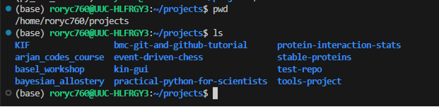

## Practical Tips:

1. Where do I store my projects? 
    I have a folder called projects close to the root folder of my pc. All projects get there own folder. 
    

2. [Undoing things tutorial](ttps://git-scm.com/book/en/v2/Git-Basics-Undoing-Things)

3. Use GitHub or something like VSCode to create your initial repository rather than Git directly. This will give you the chance to add things like .gitignore files and a License file.

4. Use a .gitignore file to handle large data files or sensitive files that you don't want to include but are a part of your project. (As we saw, these can be created automatically when you make a repository with GitHub or VSCode, with good defaults for a project involving for example: python or R).

5. Commit regularly, it will make your life easier. 

---

## Other Ways to Share Research Data

- Raw research data, associated with a paper, especially large data files are probably better shared using a service like [Zenodo](https://zenodo.org/).

- There is nothing wrong with having both a GitHub and Zenodo repository for your project.

---

## GitHub Alternatives
As you hopefully now appreciate, you don't need to use GitHub to make use of Git. Alternative places to host remote repositories include for example [bitbucket](https://bitbucket.org/product/) and [GitLab](https://about.gitlab.com/) and they tend to offer very similar functionality.

