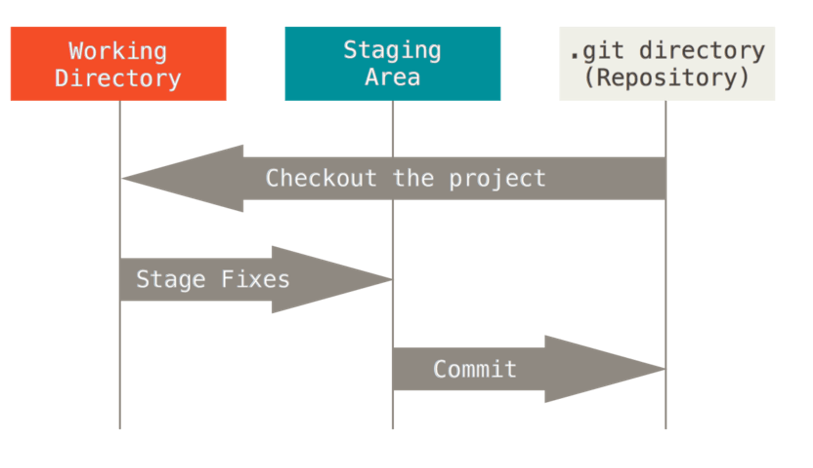

As we have now seen in [the powerpoint](TODO - add link), Git is a version control system used to track changes in source code (or other files). It enables multiple people to work on the same project simultaneously and (somewhat) independently.s


## Part 1.1 - Install Git and Create a GitHub Account
**useful links:**

- [Download git](https://git-scm.com/downloads) - select the right option for your OS.
- [Sign up to GitHub](https://github.com)

---

## Part 1.2 - Set up Git

Now we'll set some default settings for git, open up git in the command line and add these code blocks.

**Recommendation: Set your user.name to your github user name, and do not use spaces.**
```
git config --global user.name "Your_User_Name"
```

**Recommendation: Set your user.email to: "[your git hub user name]@users.noreply.github.com".**
```
git config --global user.email yourname@example.com
```

```
git config --global init.defaultBranch main
```

**Optional extra setting:**

Set the default text editor to use with git. You'll make use of this text editor when you for example write commit messages. I like to use vscode (you'll need to have it installed), you can choose something else or skip this step if you like. [Take a look here for some example editors you could use.](https://coderefinery.github.io/installation/editors/)
```
git config --global core.editor "[your text editor here] -w"
```

[By adding the `-w` flag we tell Git to wait for the code editor to force Git to wait for you to write your commit message that you would type on your custom editor.](https://stackoverflow.com/questions/9725160/aborting-commit-due-to-empty-commit-message#:~:text=When%20you%20set%20an%20editor%20in%20the%20configuration%20of%20Git%2C%20make%20sure%20to%20pass%20the%20parameter%20%22%2Dw%22%20to%20force%20Git%20to%20wait%20your%20commit%20message%20that%20you%20would%20type%20on%20your%20custom%20editor.)

**You can confirm these commands worked by doing:**

```git config --list --show-origin```

You should need see your settings added. 

---

## Part 1.3 - Create a New Git Repository
Now we'll create a local Git repository to get a feel for how things work:

First, we'll make a folder for our recipe and then initiate the repository:

```
mkdir recipe
cd recipe
git init -b main
```

Note: The "-b" flag in the git init command is short for: "--initial-branch". We set this to main. This is a standard (you may also see "master") sometimes. You don't have to set your initial branch to either of these names, but you should.

Now run:

```
git status
```

This command gives a report on the current status of our repository. Think back to the picture we saw in the presentation:


<sub><sup>Image from the Pro Git Book: https://git-scm.com/book/en/v2/Getting-Started-What-is-Git%3F</sup></sub>

The git status command will tell us where our different files are at in these steps. Of course, right now we have no files.

---

## Part 1.4 - Make our First Commit

Lets make a file inside our folder called "the_best_programming_language.txt" and add your favorite programming language inside the file.

Run the ```git status``` command again, what's changed?

Go one step further and stage the change using "git add":

```git add the_best_programming_language.txt```

Now run the ```git status``` command again, what stage is the file at now?

Finally, lets commit the file using:
```git commit```
or
```git commit -m "Added a file on the best programming language in the world" ```

The -m stands for message, and is the message you write to explain your commit,(i.e., what files have you added and what have you done with them).

What do you see now if you run git status one more time?

**Recap: the commands we've seen so far are:**

- ```git status``` : report
- ```git add [files to add]``` add file(s) to the staging area
- ```git commit``` commit the files from staging area.

---

## Part 1.5 - Make our 2nd and 3rd Commits

Now, lets make two new commits, **use git status as often as you need to check your on the right track.**

1. For the first new commit, lets create a file called "top_3_animals.txt" and add **only your favorite** animal to the file. Add this file, commit it and make sure your commit message includes an explanation for what you've done.

2. For the second commit, update the file called "top_3_animals.txt" to add the remaining two animals to the file.

---

## Part 1.6 - Looking at the Commit History

We can use the `git log` command to see the commits made to the repository (in reverse order). Each commit has a hash which provides a unique label for the commit.

Test out the following versions of `git log`:

```
git log # standard
git log --oneline # summary version
git log --stat # more detailed
```

Note: Git has a lot of functionality to compare commits (see how the files have changed between commits) or files waiting to be committed (see command: ```git diff```). That said, it's normally easier to do this in your code editor, so we'll skip it for now, [click here for a tutorial on it.](https://git-scm.com/book/en/v2/Git-Basics-Recording-Changes-to-the-Repository#:~:text=Viewing%20Your%20Staged%20and%20Unstaged%20Changes)


## Part 1.7 - Good Commit Messages

An example good commit message:

```
Change plot line colours for all graphs

Change performed because prior color palette was bad for color blind people.
Some other useful thing to know for someone else/future you. 
```

The top line is the title of the commit and should provide a quick summary. Then there is a blank line before the message body which provides more details if useful (some commits don't need a body). You don't need to include things like the file names of files you changed as it's already stored in the commit, see for example: ```git log --stat```.

[You can read more about good commit messages here.](https://gist.github.com/robertpainsi/b632364184e70900af4ab688decf6f53)


## Part 1.8 - Summary so far:

You saw after setup we used the same set of commands repeatedly to make commits:

```
git status
git add [files to add]
git commit
```

When working on just a local repository by yourself this is pretty much all you need. 

The next powerpoint will focus on how to incorporate GitHub (a remote repository) into our workflow.

Back to the powerpoint...