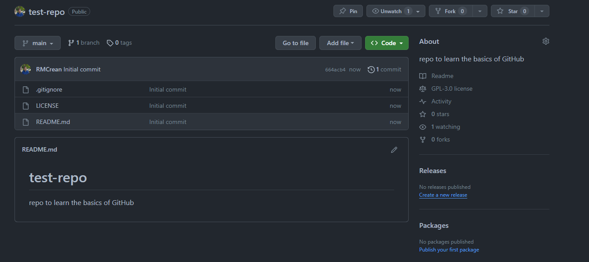
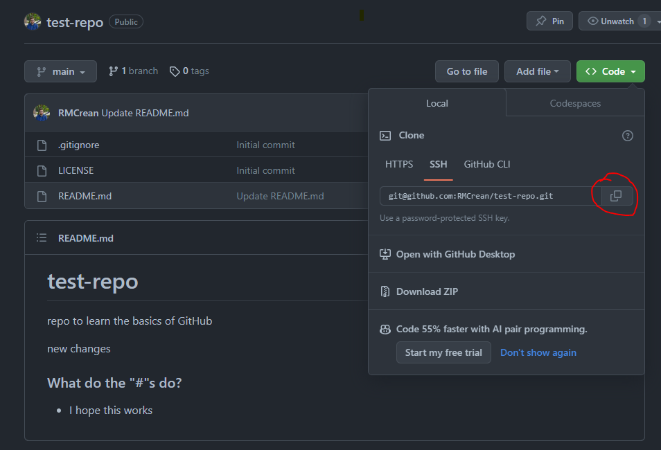

## Part 2.1, Make it easy to connect with GitHub via Git

[To do this we'll follow a short pre-existing tutorial on exactly that.](https://coderefinery.github.io/installation/ssh/). Follow the steps for SSH setup.

---

## Part 2.2, Make a new repository with GitHub

Using GitHub to create the repository can be quite useful as you can get some useful files for free:

- README - this will be displayed on the front page of the repository making it a great place to provide a summary of the project. 
- .gitignore - Language specific .gitignore files with plenty of file extensions you wont want to upload to GitHub already defined for you. 
- License - A license file for your project (if you're not sure what license to pick when you create the code, you can always add it later).

Now use github to make a new repository, make sure to add a README file, .gitignore (specific for the programming language you use) and License (don't worry about which one you pick).


Once made, it should look like something like this:


Note that we can upload files and edit files directly with GitHub.

---

## Part 2.3, Make a commit on GitHub
It's quite rare to do this (perhaps except for updating README files), but lets use GitHub to make a commit.

We'll update the README with some more text. Click on the README file and then click on the pencil in the top left corner of the document to enter edit mode.

The README file is a [markdown](https://docs.github.com/en/get-started/writing-on-github/getting-started-with-writing-and-formatting-on-github/basic-writing-and-formatting-syntax) file, with extension ".md". This allows you to easily format the document, [see this GitHub guide on markdown](https://docs.github.com/en/get-started/writing-on-github/getting-started-with-writing-and-formatting-on-github/basic-writing-and-formatting-syntax). Fun fact, The document you're reading right now was written in markdown.

**Task:** Update the README on GitHub with some markdown formatted content, include things like some bullet points, an extra title and some text in bold. [Use this markdown guide from GitHub](https://docs.github.com/en/get-started/writing-on-github/getting-started-with-writing-and-formatting-on-github/basic-writing-and-formatting-syntax) to help you if you don't know the syntax. 

**Tip:** Regularly swap between the edit and preview modes to check you're formatting correctly.

---

## Part 2.4, Make a local copy of the GitHub Repo

As we covered in the powerpoint, the GitHub repository is a "remote" version of the project.

To make a local copy we'll need to clone it. Use the SSH option that we setup in Part 2.1



Then in a terminal do:

```
git clone [repository to clone, copied from the picture above]
cd test-repo
ls -alh
```

If you get a error about SSH keys not being setup, go back to the tutorial on Step 2.1 and make sure it is setup correctly (ask for help if unsure).
By running the `ls -alh` command we can see the files in this newly created folder include a `.git` folder. We can also run a `git status` command to see the current state of the repository.

Finally if we run the command:

```
git remote -v
```

You should see something like:

```
origin  git@github.com:RMCrean/test-repo.git (fetch)
origin  git@github.com:RMCrean/test-repo.git (push)
```

This essentially means we have the ability to push and pull (for now think of "pull" and "fetch" as the same) commits from our local repo to our remote repo on GitHub. Let's do that.

---

## Part 2.5, Push a Local Change to the Remote Repository

Now we'll make a local commit and push this change to the remote repository on GitHub. Follow the same steps as you did for Part 1 (create/update file, add files to staging area, commit files). Once you're done run `git status`, you'll see something along these lines:

```
On branch main
Your branch is ahead of 'origin/main' by 1 commit.
```

Here origin/main refers to the remote (GitHub). As the message implies, we have changes (commits) we can "push" to GitHub. To do that run:

```
git push
```

Go take a look at the repository on GitHub, you should see the new changes now added.

---

## Part 2.6, Make a Remote Commit and "Pull" to Update the Local Repository

Now lets do the reverse. Go to main page of your new GitHub repo and click on add file and either upload or add a new file directly.

Now if we run `git status` in our local repository it should say we are 1 commit behind, but instead what do we see?

<details markdown="1">
 <summary>Spoiler</summary>
We see we're up to date. So the changes on the remote aren't yet known about on our local repository.
</details>


To check for changes on the remote repository we need to first run:

```
git remote update
```

After this `git status` will correctly tell us we are 1 commit behind and we can pull the change using:

```
git pull
```

Now our local and remote versions are up to date again.

---

### Part 2 - Summary:

You saw after setting up the remote and local repositories we used the same 2 commands on top of the ones we already learned:

```
git status # old
git add [files_to_add] # old
git commit # old
git push # new
git pull # new 
```

For projects that you work on alone, that's not too far from the truth once you're setup. 

Back to the powerpoint...
