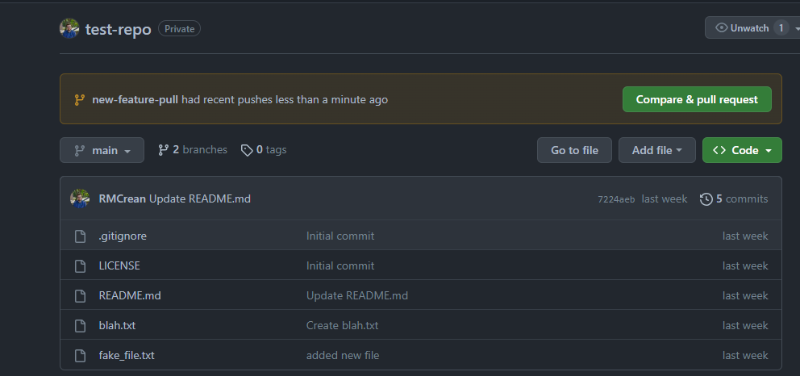

## Hands on Session - Part 3, Branches and Merging

- **Recap: Branch** Branching lets you have different versions of a repository at one time. By default, your repository has one branch named `main` (sometimes called `master` instead) that is considered to be the definitive/central branch. Typically a new branch is used to work on new features or bug fixes without affecting the main codebase until you are ready to merge the changes.

- **Recap: Merge** Merging combines changes from different branches into a single branch, typically changes are merged into the `main` branch.


<sub><sup>Image taken from coderefinery: https://coderefinery.github.io/git-intro/branches/ </sup></sub>

---

## Part 3.1, Create a New Branch:

Now we'll create a new branch inside our repository. 


```
git branch new-feature main
```

This means we'll create a new branch called `new-feature` using a copy of the current state of the `main` branch. 

Now if we run:
```
git branch 
```

We'll see two branches, and the branch we are working on (main) indicated by an asterisk.

To swap to the other branch we can do: 

```
git checkout new-feature
```

If you now run `git branch` again, you'll now see we're working in the `new-feature` branch. 


Tip: you can combine the creation of a new branch and swapping to the branch is a single step:

```
git checkout -b new-feature main
```

---

## Part 3.2, Make a Commit in the New Branch and Merge them. 

Add a new file and commit this file to the new branch. 

Tip: Make sure you're working in the `new-feature` branch, you can check by typing: `git branch`.

Once you've made the commit, we first swap back to the `main` branch:

```
git checkout main
```

Then we merge the `new-feature` branch into the `main` branch: 

```
git merge new-feature
```

At this point you should see the new file you created inside the main branch. You can also safely delete the `new-feature` branch (recommended, otherwise you'll end up with a large number of branches after a while which can be confusing).

```
git branch -d new-feature
```

If you run `git branch` now you should see the `new-feature` branch no longer exists. 


---

## Part 3.3, Merge Two Branches Using a GitHub Pull Request

Now we'll repeat essentially the same process but this time instead of using the merge command in Git, we'll use (GitHub's pull request)[] feature instead.

1. Create the new branch and switch to it: 

```
git checkout -b new-feature-pull main
```

2. Add a new file, commit the file, making sure you're in the `new-feature-pull` repository. 

3. Push the new file to the remote repository. 

Note that if we try to use just `git push` it wont work, instead we'll need to do:

```
git push -u origin new-feature-pull
```

It's not important right now to understand but the `-u` is short for `--set-upstream` option, which essentially sets up our `git pull` or `git push` commands for this new branch.

Now head over to GitHub and go to the main page of your repository, where you should see a message like this:


If we click to "compare and pull" we can start the pull request process. 

This is best shown on the board, so I'll show this at the time and we can follow along. To revise the topic later on you can (click here for a nice guide/tutorial)[https://docs.github.com/en/pull-requests/collaborating-with-pull-requests/proposing-changes-to-your-work-with-pull-requests/creating-a-pull-request]


Once the pull request is successful we can go ahead and delete the old branch, you could do this on Git (as we saw in Part 3.2) or on GitHub. 

---

## Part 3.4, Merge Conflicts

So far we've seen examples of merges where the changes made don't create conflicts. But sometimes life is not that easy. 


---

## Part 3.5, TODO.


---

## Appendix

